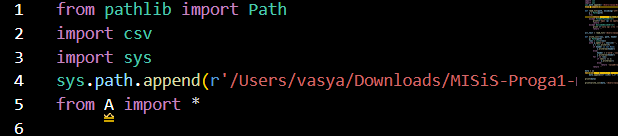
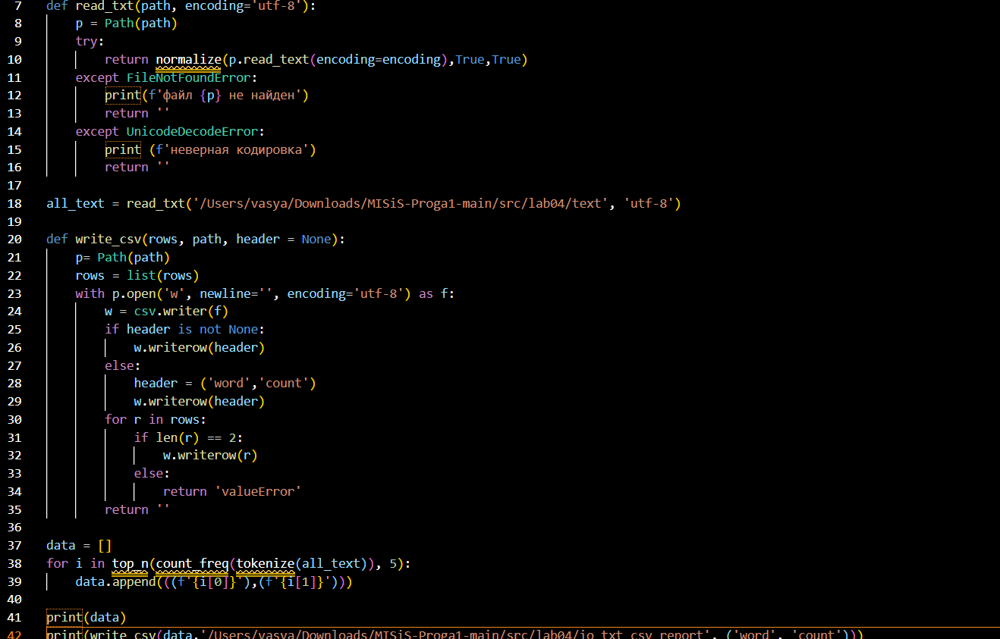
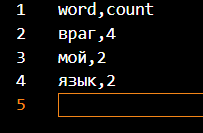
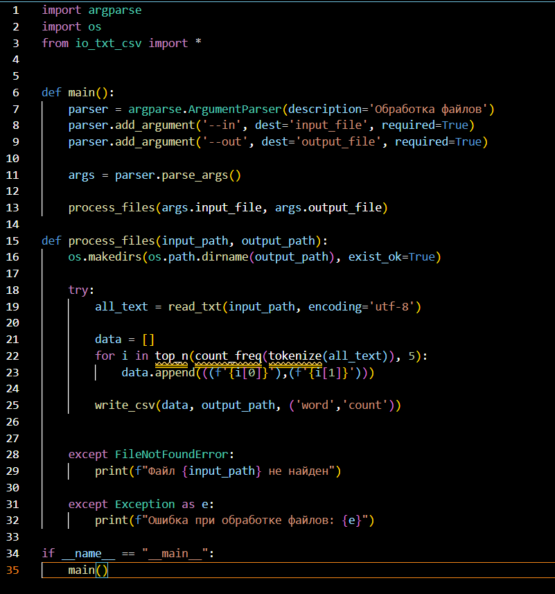
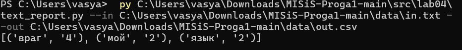
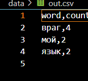

<h1> Задание 1 <h1>

<h2>io_txt_csv<h2>

<h2>файл txt для io_txt_csv<h2>

<h2>файл полученный на выходе<h2>

<h1>Задание 2<h1>

textreport

<h2>команда, которую вводил в терминал, для запуска скрипта<h2>

<h2>файл созданный скриптом<h2>

