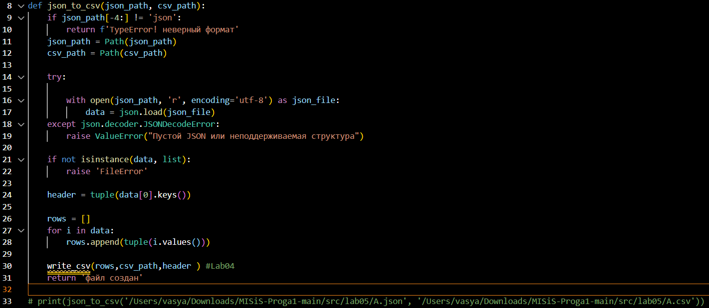
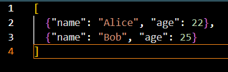
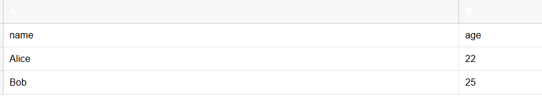
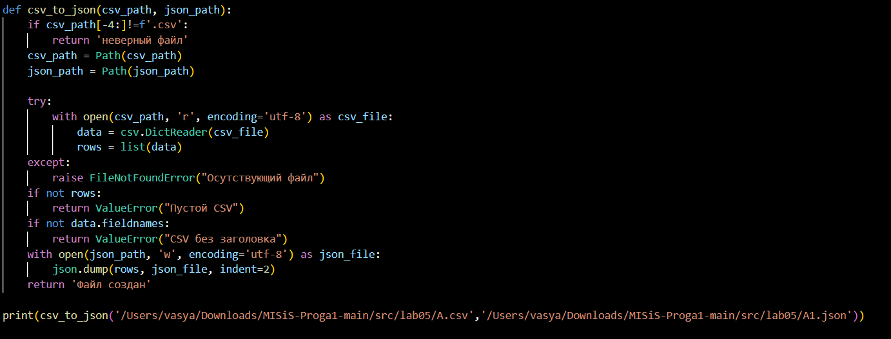
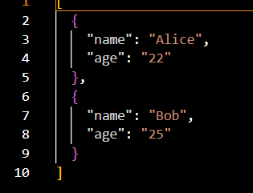
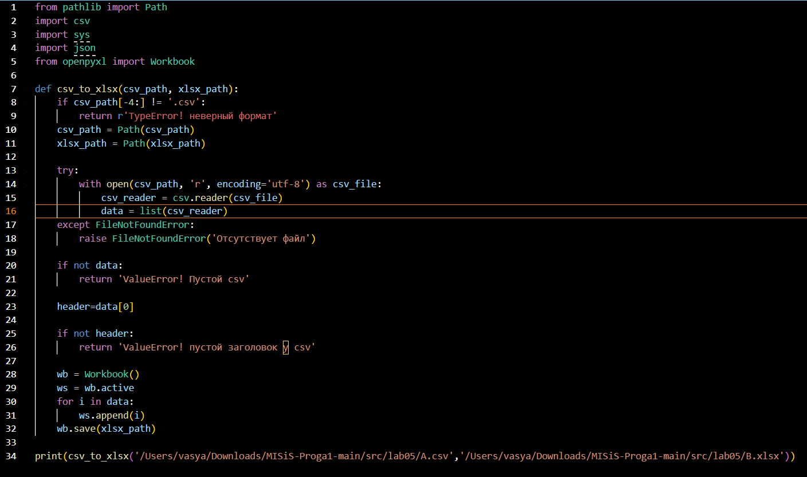
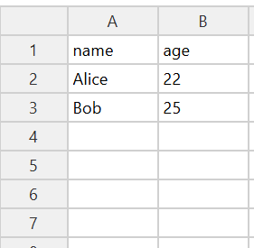

Задание 1 json_to_csv

библиотеки для работы файла

json_to_csv

файл json на ввод:

выход после работы json_to_csv:

csv_to_json

(файл на ввод тот же)

выход после csv_to_json

Задание 2 csv_xlsx

csv_xlsx

выход после csv_xlsx

