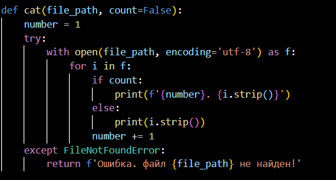
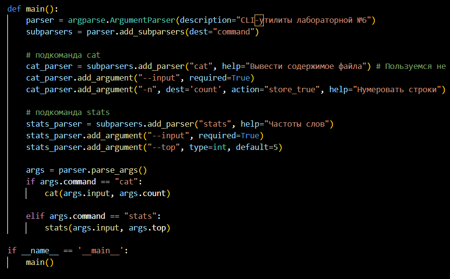
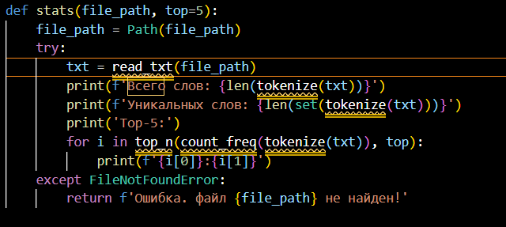
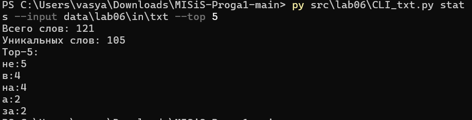
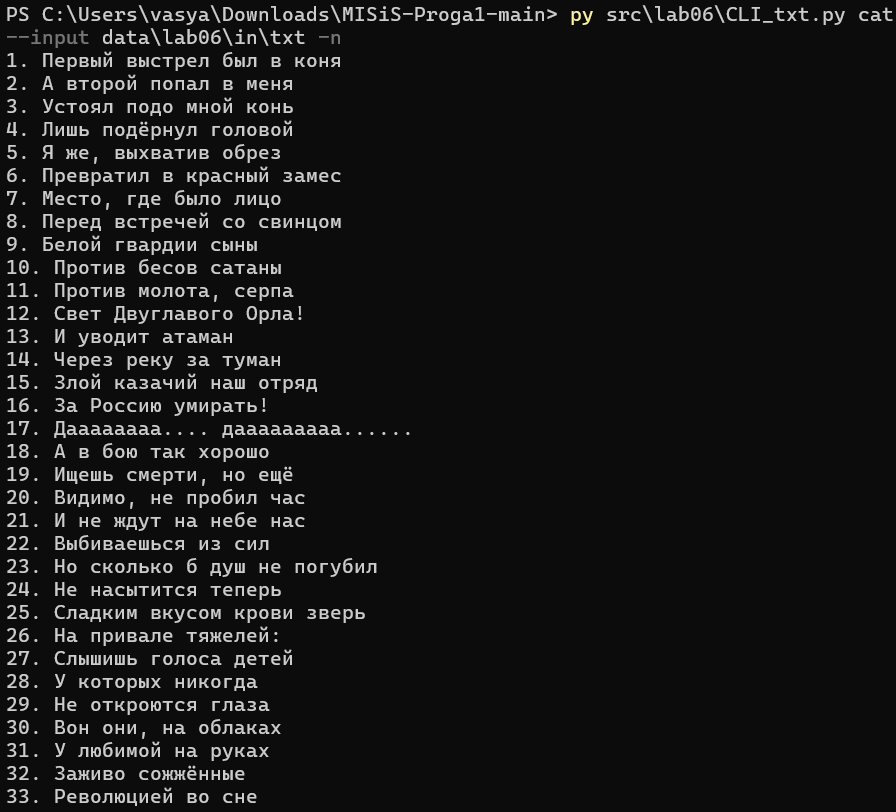
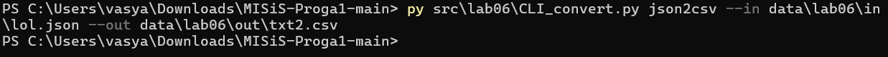
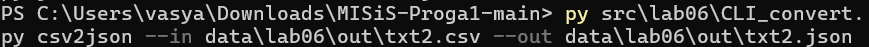
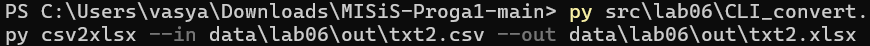
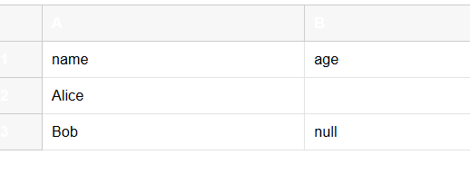

Задание 1 Cli_txt:

библиотеки для работы скрипта:

cat:

main

stats

выход после работы stats

выход после работы cat

задание 2 Cli_convert

библиотеки для работы скрипта:

main:

команды введенные в сmd

файлы на выходе:

