<h1>Файл group.py:<h1>

 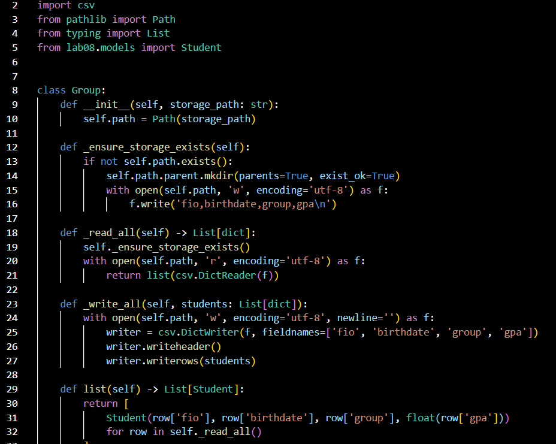    

 <h1> Выводы кода <h1>

добавить студента:

 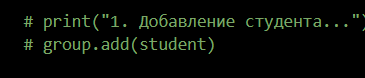
 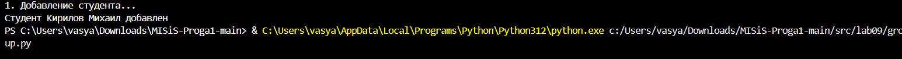
 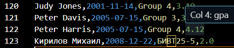

 все студенты:

 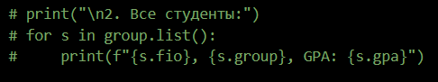
 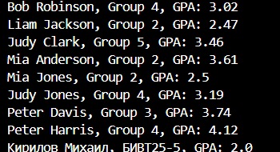

искать студента:

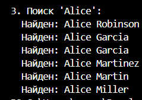

обновить информацию о студенте:

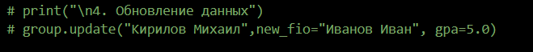
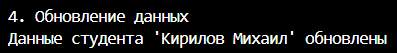
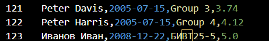

 удалить студента:

 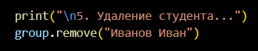
 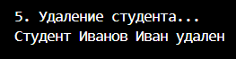

статистика по студентам:

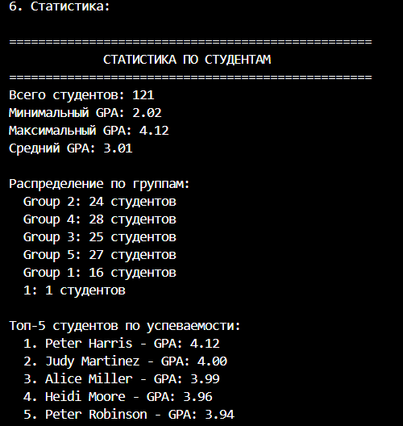