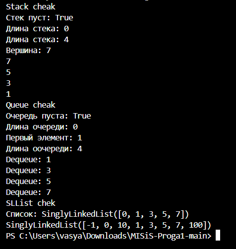

structures

```python
from collections import deque

class Stack:
    """Реализация стека (LIFO) на базе списка"""
    def __init__(self):
        """Инициализирует пустой стек"""
        # внутреннее хранилище стека
        self._data = []

    def push(self, item):
        """Добавляет элемент на вершину стека"""
        # корректно: добавление в конец списка O(1) амортизированно
        #item элемент для добавления
        self._data.append(item)

    def pop(self):
        """Удаляет и возвращает элемент с вершины стека"""
        if self._data == []:
            raise IndexError("Стек пуст! Нельзя делать pop() из пустого стека")
        return self._data.pop()

    def peek(self):
        """Возвращает элемент с вершины стека без удаления"""
        if self._data == []:
            return None
        return self._data[-1]

    def is_empty(self) -> bool:
        """Проверяет пуст ли стек"""
        return len(self._data) == 0
    
    def __len__(self):
        """Возвращает количество элементов в стеке"""
        return len(self._data)


class Queue:
    """Реализация очереди (FIFO) на базе deque"""
    def __init__(self):
        """Инициализирует пустую очередь"""
        # ошибка: вместо deque используется list → операции O(n)
        self._data = deque()

    def enqueue(self, item):
        """Добавляет элемент в конец очереди"""
        # ошибка: вставка в начало, а не в конец
        self._data.append(item)

    def dequeue(self):
        """Удаляет и возвращает элемент из начала очереди"""
        # ошибка: удаление с конца, а не с начала
        #Если очередь пустая — исключение (например, IndexError)
        if len(self._data) == 0:
            raise IndexError("Очередь пустая! нельзя делать dequeue() из усткой очереди.")
        return self._data.popleft()

    def peek(self):
        """Возвращает первый элемент очереди без удаления"""
        # TODO: корректное поведение при пустой очереди
        if len(self._data) == 0: #Первый элемент очереди или None, если очередь пуста
            return None
        return self._data[0]

    def is_empty(self) -> bool:
        """Проверяет, пуста ли очередь"""
        return len(self._data) == 0
    
    def __len__(self):
        """Возвращает количество элементов в очереди"""
        return len(self._data)
        ```

linked_list

```python
class Node:
    """Узел односвязного списка"""
    def __init__(self, value, next=None):
        self.value = value #значение узла
        self.next = next   #ссылка на следующий узел или None


class SinglyLinkedList:
    """Односвязный список"""
    def __init__(self):
        """Инициализирует пустой список"""
        self.head = None #ссылка на первый узел или None
        self._size = 0   #количество элементов в списке

    def append(self, value):
        """Добавить элемент в конец списка"""
        new_node = Node(value) #value значение для добавления
        if self.head is None: #если список пуст, новый узел становится головой
            self.head = new_node
            self._size += 1
            return

        # неэффективность: полный обход списка O(n)
        current = self.head #текущий узел
        while current.next is not None: #пока след. эл. ссылающийся за текущим не является None, переходим на след
            current = current.next
        current.next = new_node
        self._size += 1

    def prepend(self, value):
        """Добавить элемент в начало списка"""
        new_node = Node(value, next=self.head) #создаем новый узел, который ссылается на текущую голову
        self.head = new_node #новый узел становится новой головой
        self._size += 1

    def insert(self, idx, value):
        """Вставка по индексу — неполная реализация, есть ошибки"""
        if idx < 0: #индекс для вставки (0 ≤ idx ≤ len(list))
            raise IndexError("Negative index is not supported")
        if idx > self._size:
            raise IndexError("Index is too. There are only {self._size} elements in the List")

        if idx == 0: #вставка в начало prepend
            self.prepend(value)
            return

        current = self.head #вставка в середину или конец
        for _ in range(idx - 1): #идем до узла, предшествующего позиции вставки
            current = current.next

        #создаем новый узел и вставляем его
        new_node = Node(value, next=current.next)
        current.next = new_node
        self._size += 1

    # Можно добавить для полноты:
    def remove_at(self, idx):
        """Удаляет элемент по указанному индексу"""
        if idx < 0 or idx >= self._size:
            raise IndexError(f"Index {idx} out of range [0, {self._size-1}]")
        
        if idx == 0:
            value = self.head.value
            self.head = self.head.next
            self._size -= 1
            return value
        
        current = self.head # Удаление из середины или конца
        for _ in range(idx - 1): # Ищем узел перед удаляемым
            current = current.next
        value = current.next.value #Запоминаем значение удаляемого узла
        current.next = current.next.next # Пропускаем удаляемый узел
        self._size -= 1
        return value

    def __iter__(self):
        """Возвращает итератор по значениям списка"""
        current = self.head
        while current is not None:
            yield current.value # Возвращаем значение текущего узла
                                # yield делает функцию генератором
            current = current.next  # Переходим к следующему

    def __len__(self):
        """Возвращает количество элементов в списке"""
        return self._size

    def __repr__(self):
        """Строковое представление списка"""
        values = list(self)
        return f"SinglyLinkedList({values})"
        ```
вывод после работы:

